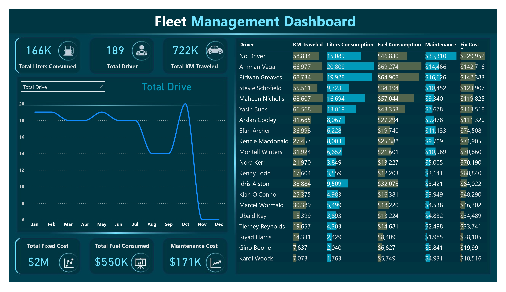
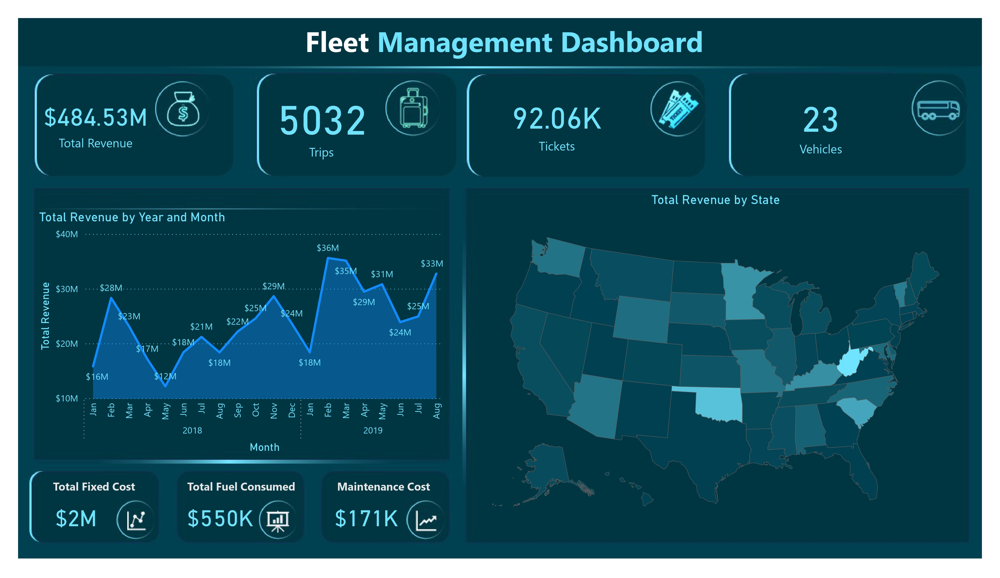
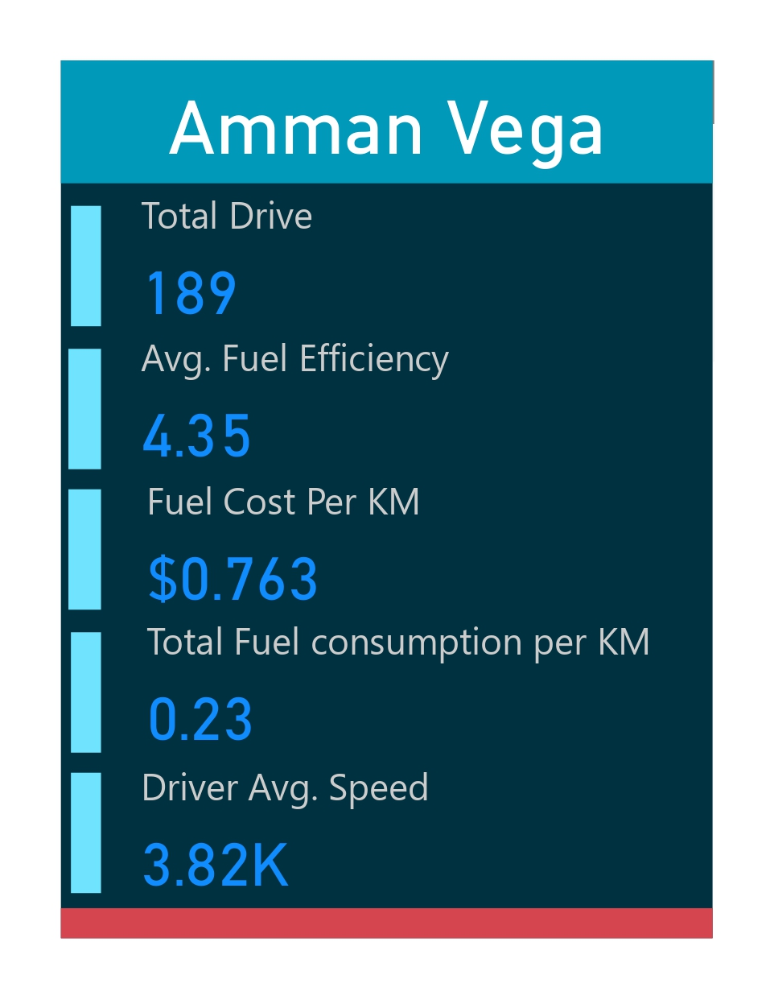

# Fleet Management Dashboard

This project is a comprehensive Fleet Management Dashboard built using Power BI Desktop.  
It helps monitor and analyze key performance indicators (KPIs) such as driver performance, fuel consumption, maintenance costs, and revenue trends.

---

## Features

- Driver statistics: KM traveled, fuel consumption, maintenance costs, and fix costs.
- Revenue breakdown by year, month, and state.
- Total fleet statistics including trips, tickets, and vehicles.
- Visual insights to optimize fleet operations and reduce costs.

---

## Screenshots

### Fleet KPIs  

### Revenue Breakdown  

### Driver Performance  

---

## Usage

Open the Power BI Desktop file included in the repository to explore the interactive dashboard with live data visuals.

---

## Contributing

Feel free to fork this repository, make improvements, and submit pull requests.

---

## License

This project is open source and available under the MIT License.

---

*Made with ❤️ by mostafarahimtaha*
